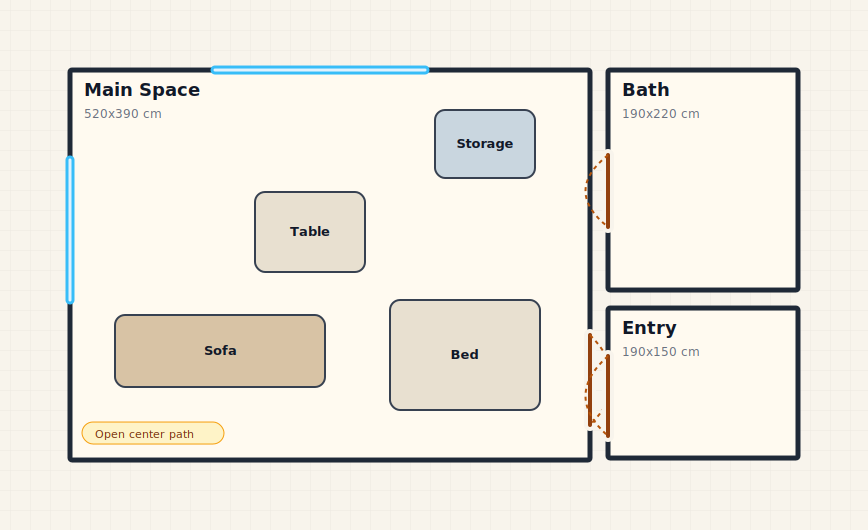

# MarkHome

Markdown for simple 2D home layout diagrams.



Live docs and playground: https://bkalafat.github.io/markhome/

```markhome
home "My Apartment" unit cm

room LivingRoom at 0,0 size 420x360
window LivingRoom north at 110 size 180
door LivingRoom east at 155 size 90
item sofa in LivingRoom at 55,245 size 230x75
```

MarkHome is intentionally small:

```txt
Text -> Parser -> AST -> SVG 2D diagram
```

It is not a CAD tool, BIM tool, 3D planner, AI interior designer, or marketplace.

## Install

```bash
npm install markhome
npm install -D @bkalafat/markhome-cli
```

## Browser Usage

```html
<pre class="markhome">
home "My Apartment" unit cm

room LivingRoom at 0,0 size 420x360
window LivingRoom north at 110 size 180
door LivingRoom east at 155 size 90
item sofa in LivingRoom at 55,245 size 230x75
</pre>

<script type="module">
  import markhome from "https://cdn.jsdelivr.net/npm/markhome/+esm";

  markhome.initialize({
    startOnLoad: true
  });
</script>
```

## Playground

Try MarkHome in the browser:

```txt
https://bkalafat.github.io/markhome/playground.html
```

## Programmatic Usage

```ts
import { parse, render, renderSvg } from "markhome";

const source = `
home "My Apartment" unit cm
room LivingRoom at 0,0 size 420x360
`;

const ast = parse(source);
const svg = renderSvg(ast);
const sameSvg = render(source);
```

## CLI

```bash
npx @bkalafat/markhome-cli room.markhome -o room.svg
```

After installing `@bkalafat/markhome-cli`, the local CLI binary is also available as:

```bash
npx markhome room.markhome -o room.svg
```

## Syntax

```txt
home "Name" unit cm

room RoomId at x,y size wxh label "Label"
room RoomId right_of OtherRoom gap 20 size wxh label "Label"
room RoomId below OtherRoom gap 20 size wxh label "Label"

door RoomId north|south|east|west at number size number
window RoomId north|south|east|west at number size number

item type in RoomId at x,y size wxh label "Label"

note RoomId "Text"
```

## Workspace

```txt
apps/
  docs/
  playground/
packages/
  core/
  svg/
  markhome/
  cli/
examples/
SPEC.md
```

## Development

```bash
corepack pnpm install
corepack pnpm build
corepack pnpm dev
```

## Roadmap

- v0.1: parser, SVG renderer, package API, CLI, playground, examples
- v0.2: Markdown/remark integration, docs integration, syntax highlighting
- v1.0: stable language spec and compatibility policy

## License

MIT
